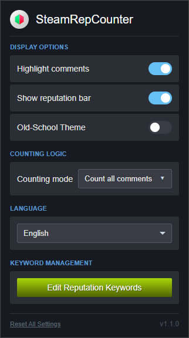
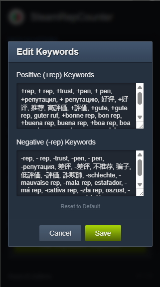
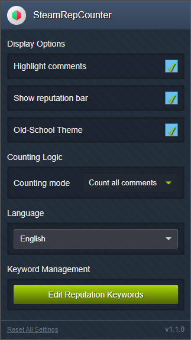

# SteamRepCounter

**RU:** Простое и мощное расширение для Chrome, которое точно подсчитывает репутацию в комментариях профилей Steam.

**EN:** A simple and powerful Chrome extension that accurately calculates reputation in Steam profile comments.

---
### RU:

#### Что нового в версии 1.1.0 (Полная переработка)
Появилась иконка расширения, где можно настроить всё: от логики подсчёта до внешнего вида.
Доступны две темы: современная (Default) и ностальгическая (Old-School) в стиле старого Steam.
Теперь вы можете сами редактировать списки слов для `+rep` и `-rep`.
При наведении на аватар пользователя появляется полоса его репутации.
Интерфейс настроек переведён на все языки Steam.
Результаты подсчёта кэшируются для быстрой загрузки.

#### Установка для Chrome
Установить расширение можно в один клик с официального магазина дополнений Chrome:

**[Firefox Browser ADD-ONS](https://chromewebstore.google.com/detail/steam-rep-counter/dfmdgdoiibdedklijkipfgegpglgdpje?hl=ru&authuser=0 "Перейти на страницу дополнения")**
---
#### Установка для FireFox
Установить расширение можно в один клик с официального магазина дополнений Firefox:

**[Firefox Browser ADD-ONS](https://addons.mozilla.org/ru/firefox/addon/steam-rep-counter/ "Перейти на страницу дополнения")**
---

### EN:

#### What's new in version 1.1.0 (Complete Overhaul)
An extension icon has been added, where you can configure everything from counting logic to appearance.
Two themes are available: a modern (Default) and a nostalgic (Old-School) one in the style of old Steam.
You can now edit the keyword lists for `+rep` and `-rep` yourself.
A reputation bar now appears when hovering over a user's avatar.
The settings interface has been translated into all languages supported by Steam.
Reputation results are cached for faster loading.

#### Installation for Chrome
You can install the extension with a single click from the official Chrome Add-ons store:

**[Firefox Browser ADD-ONS](https://chromewebstore.google.com/detail/steam-rep-counter/dfmdgdoiibdedklijkipfgegpglgdpje?hl=ru&authuser=0 "Go to the add-on page")**
---

#### Installation for FireFox
You can install the extension with a single click from the official Firefox Add-ons store:

**[Firefox Browser ADD-ONS](https://addons.mozilla.org/ru/firefox/addon/steam-rep-counter/ "Go to the add-on page")**
---

|  |  |  |
|:---:|:---:|:---:|
---

