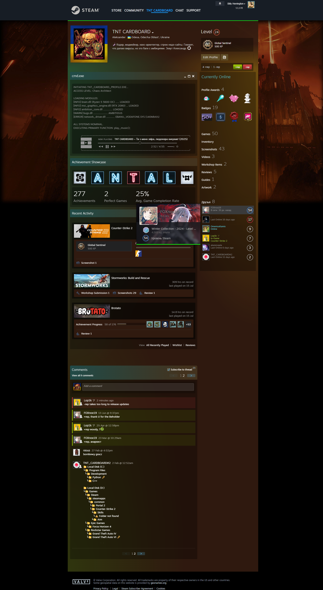

# SteamRepCounter

**RU:** Простое и мощное расширение для Firefox, которое точно подсчитывает репутацию в комментариях профилей Steam.

**EN:** A simple and powerful Firefox extension that accurately calculates reputation in Steam profile comments.

---

### RU:

#### Установка
Установить расширение можно в один клик с официального магазина дополнений Firefox:

**[Установить с Firefox Browser ADD-ONS](https://addons.mozilla.org/ru/firefox/addon/steam-rep-counter/ "Перейти на страницу дополнения")**

#### Исходный код
Расширение имеет открытый исходный код. Вы можете ознакомиться с ним в репозитории на GitHub. Последняя версия всегда доступна на странице "Releases".

---

### EN:

#### Installation
You can install the extension with a single click from the official Firefox Add-ons store:

**[Install from Firefox Browser ADD-ONS](https://addons.mozilla.org/ru/firefox/addon/steam-rep-counter/ "Go to the add-on page")**

#### Source Code
This extension is open-source. You can review the code in the GitHub repository. The latest version is always available on the "Releases" page.

---

